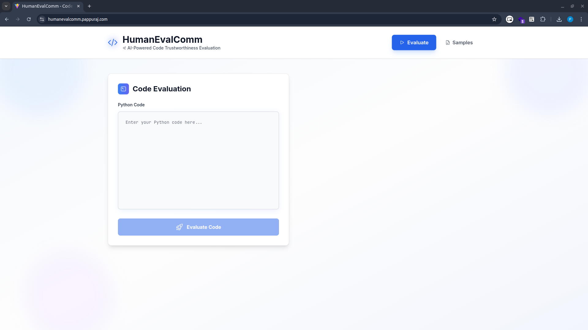
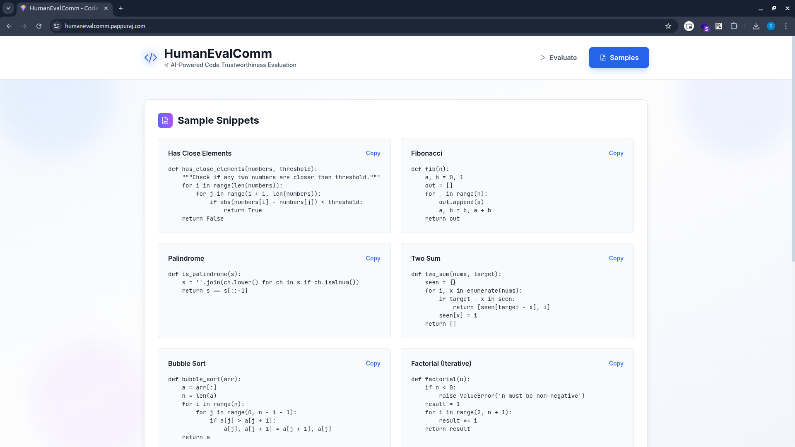
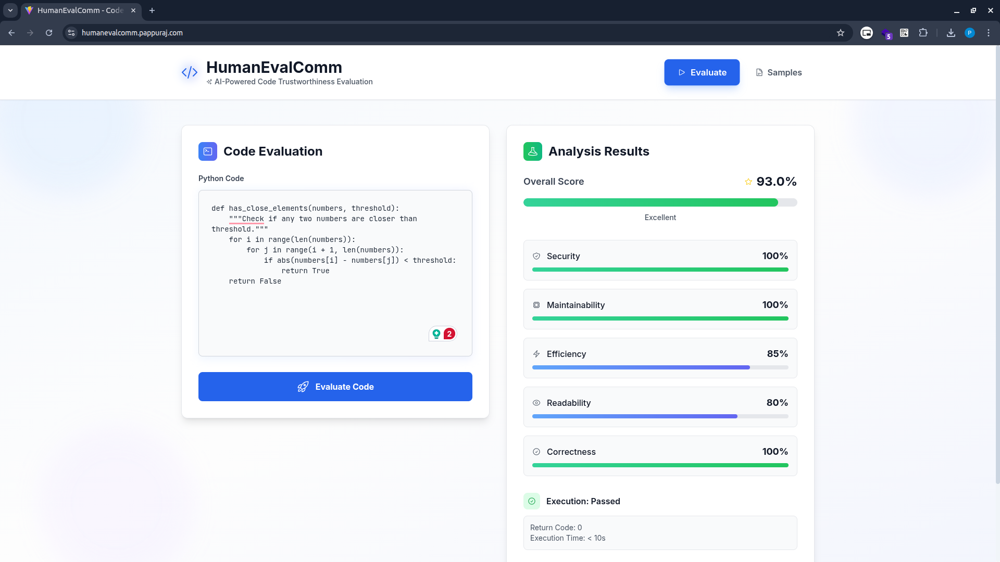
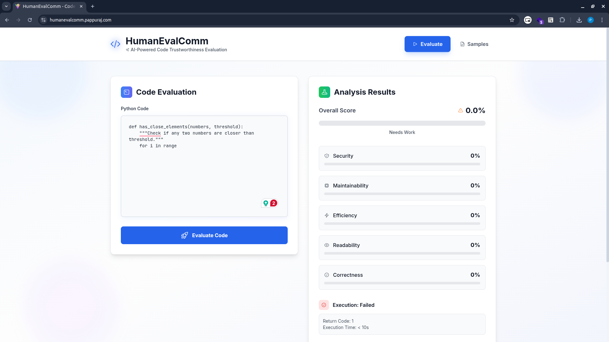

# HumanEvalComm: Enhanced Web Platform for LLM Communication Evaluation

<div align="center">


<a href="https://humanevalcomm.pappuraj.com">
</img>
</a>

**[Live Demo: humanevalcomm.pappuraj.com](https://humanevalcomm.pappuraj.com)**

<br></br>
  <a href="https://arxiv.org/abs/2406.00215"></a>
  <a href="https://huggingface.co/datasets/jie-jw-wu/HumanEvalComm"></a>
  <a href="https://github.com/jie-jw-wu/human-eval-comm/stargazers"></a>
  <hr>
</div>

## Platform Overview

This repository contains an enhanced web-based platform for the HumanEvalComm benchmark, featuring a modern React frontend, Flask API backend, and comprehensive deployment infrastructure. The platform makes LLM communication evaluation accessible through an intuitive web interface.

### Key Features

- **Modern Web Interface**: React + Vite + Tailwind CSS for responsive design
- **RESTful API**: Flask-based backend with comprehensive evaluation endpoints
- **Real-time Evaluation**: Async task processing with status tracking
- **Docker Deployment**: Containerized application with Nginx reverse proxy
- **Production Ready**: Deployed on Ubuntu 22.04 LTS with SSL certificates
- **Mobile Responsive**: Optimized for all device sizes

## Frontend Screenshots

### Landing Page

*Clean, modern landing page with intuitive navigation and clear call-to-action buttons*

### Sample Programs Interface

*Interactive interface for browsing and selecting sample programming problems*

### Evaluation Results

*Detailed results display showing evaluation metrics, code output, and performance statistics*

### Error Handling

*Robust error handling with clear feedback and recovery options*


## Technology Stack

### Frontend
- **React 19.1.1** - Modern UI framework
- **Vite 7.1.2** - Fast build tool and dev server
- **Tailwind CSS 4.1.13** - Utility-first CSS framework
- **React Router 7.9.1** - Client-side routing
- **Axios 1.12.2** - HTTP client for API calls
- **Lucide React 0.544.0** - Beautiful icons

### Backend
- **Flask** - Lightweight Python web framework
- **Flask-CORS** - Cross-origin resource sharing
- **Threading** - Background task processing
- **Queue** - Async task management
- **OpenAI API** - LLM integration

### Deployment
- **Docker** - Containerization
- **Nginx** - Reverse proxy and load balancer
- **Ubuntu 22.04 LTS** - Production server
- **SSL/TLS** - Secure HTTPS connections
- **Systemd** - Service management

## Quick Start

### Prerequisites
- Node.js 18+ and npm
- Python 3.10+
- Docker and Docker Compose
- Ubuntu 22.04 LTS (for production)

### Development Setup

1. **Clone the repository**
```bash
git clone https://github.com/your-username/human-eval-comm.git
cd human-eval-comm
```

2. **Backend Setup**
```bash
# Create virtual environment
python -m venv venv
source venv/bin/activate  # On Windows: venv\Scripts\activate

# Install dependencies
pip install -r requirement.txt
pip install flask flask-cors

# Set environment variables
export OPENAI_KEY='your-openai-api-key'
export OPENAI_API_KEY='your-openai-api-key'

# Run the API server
cd api
python app.py
```

3. **Frontend Setup**
```bash
cd frontend

# Install dependencies
npm install

# Start development server
npm run dev
```

4. **Access the application**
- Frontend: http://localhost:3000
- API: http://localhost:5001
- API Health: http://localhost:5001/health

### Production Deployment

1. **Docker Deployment**
```bash
# Build and run with Docker Compose
docker-compose up -d

# Or build individual containers
docker build -t humanevalcomm-frontend ./frontend
docker build -t humanevalcomm-api ./api
```

2. **Ubuntu 22.04 LTS Deployment**
```bash
# Install Nginx
sudo apt update
sudo apt install nginx

# Configure Nginx
sudo nano /etc/nginx/sites-available/humanevalcomm
sudo ln -s /etc/nginx/sites-available/humanevalcomm /etc/nginx/sites-enabled/
sudo nginx -t
sudo systemctl reload nginx

# Install SSL certificate
sudo apt install certbot python3-certbot-nginx
sudo certbot --nginx -d humanevalcomm.pappuraj.com
```

## API Endpoints

### Core Evaluation Endpoints

| Method | Endpoint | Description |
|--------|----------|-------------|
| `GET` | `/health` | Health check |
| `GET` | `/api/v1/models` | Available models |
| `GET` | `/api/v1/datasets` | Available datasets |
| `GET` | `/api/v1/phases` | Evaluation phases |
| `POST` | `/api/v1/evaluate` | Single problem evaluation |
| `POST` | `/api/v1/evaluate/async` | Async evaluation |
| `GET` | `/api/v1/tasks/<task_id>` | Task status |
| `POST` | `/api/v1/evaluate/batch` | Batch evaluation |

### Example API Usage

```bash
# Health check
curl http://localhost:5001/health

# Get available models
curl http://localhost:5001/api/v1/models

# Evaluate a problem
curl -X POST http://localhost:5001/api/v1/evaluate \
  -H "Content-Type: application/json" \
  -d '{
    "dataset": "HumanEvalComm",
    "model": "gpt-3.5-turbo",
    "problem_text": "Write a function to sort an array",
    "phase": 0
  }'
```

## Frontend Features

### Dashboard
- **Overview**: System status and recent evaluations
- **Quick Actions**: Start new evaluations
- **Statistics**: Performance metrics and charts

### Single Evaluation
- **Problem Input**: Text area for problem descriptions
- **Model Selection**: Choose from available models
- **Parameter Tuning**: Temperature, top-n, and other settings
- **Real-time Results**: Live evaluation feedback

### Async Evaluation
- **Task Management**: Start long-running evaluations
- **Progress Tracking**: Real-time status updates
- **Result Retrieval**: Download completed results

### Batch Evaluation
- **Multiple Problems**: Upload or input multiple problems
- **Bulk Processing**: Efficient batch operations
- **Progress Monitoring**: Track batch progress

## Configuration

### Environment Variables
```bash
# Required
OPENAI_KEY=your-openai-api-key
OPENAI_API_KEY=your-openai-api-key

# Optional
FLASK_ENV=production
FLASK_DEBUG=False
API_HOST=0.0.0.0
API_PORT=5001
```

### Nginx Configuration
```nginx
server {
    listen 80;
    server_name humanevalcomm.pappuraj.com;
    
    location / {
        proxy_pass http://localhost:3000;
        proxy_set_header Host $host;
        proxy_set_header X-Real-IP $remote_addr;
    }
    
    location /api/ {
        proxy_pass http://localhost:5001;
        proxy_set_header Host $host;
        proxy_set_header X-Real-IP $remote_addr;
    }
}
```

## Performance and Monitoring

### Metrics Tracked
- **Response Time**: API endpoint performance
- **Task Completion**: Async task success rates
- **Error Rates**: System reliability metrics
- **Resource Usage**: CPU, memory, and disk usage

### Monitoring Setup
```bash
# Install monitoring tools
sudo apt install htop iotop nethogs

# Monitor system resources
htop
iotop -o
nethogs

# Check application logs
journalctl -u humanevalcomm-api -f
journalctl -u humanevalcomm-frontend -f
```

## Docker Configuration

### Frontend Dockerfile
```dockerfile
FROM node:18-alpine
WORKDIR /app
COPY package*.json ./
RUN npm ci --only=production
COPY . .
RUN npm run build
EXPOSE 3000
CMD ["npm", "run", "preview"]
```

### Backend Dockerfile
```dockerfile
FROM python:3.10-slim
WORKDIR /app
COPY requirements.txt .
RUN pip install -r requirements.txt
COPY . .
EXPOSE 5001
CMD ["python", "app.py"]
```

### Docker Compose
```yaml
version: '3.8'
services:
  frontend:
    build: ./frontend
    ports:
      - "3000:3000"
    environment:
      - NODE_ENV=production
  
  api:
    build: ./api
    ports:
      - "5001:5001"
    environment:
      - OPENAI_KEY=${OPENAI_KEY}
      - FLASK_ENV=production
  
  nginx:
    image: nginx:alpine
    ports:
      - "80:80"
      - "443:443"
    volumes:
      - ./nginx.conf:/etc/nginx/nginx.conf
    depends_on:
      - frontend
      - api
```

## Security Features

- **HTTPS/SSL**: Encrypted communication
- **CORS Protection**: Cross-origin request security
- **Input Validation**: Request sanitization
- **Rate Limiting**: API abuse prevention
- **Environment Variables**: Secure configuration management

## Deployment Process

### 1. Server Setup (Ubuntu 22.04 LTS)
```bash
# Update system
sudo apt update && sudo apt upgrade -y

# Install Docker
curl -fsSL https://get.docker.com -o get-docker.sh
sudo sh get-docker.sh
sudo usermod -aG docker $USER

# Install Docker Compose
sudo curl -L "https://github.com/docker/compose/releases/download/v2.20.0/docker-compose-$(uname -s)-$(uname -m)" -o /usr/local/bin/docker-compose
sudo chmod +x /usr/local/bin/docker-compose
```

### 2. Application Deployment
```bash
# Clone repository
git clone https://github.com/your-username/human-eval-comm.git
cd human-eval-comm

# Configure environment
cp .env.example .env
nano .env  # Add your API keys

# Deploy with Docker
docker-compose up -d

# Check status
docker-compose ps
docker-compose logs -f
```

### 3. Nginx Configuration
```bash
# Install Nginx
sudo apt install nginx

# Configure site
sudo nano /etc/nginx/sites-available/humanevalcomm
sudo ln -s /etc/nginx/sites-available/humanevalcomm /etc/nginx/sites-enabled/
sudo nginx -t
sudo systemctl reload nginx
```

### 4. SSL Certificate
```bash
# Install Certbot
sudo apt install certbot python3-certbot-nginx

# Get SSL certificate
sudo certbot --nginx -d humanevalcomm.pappuraj.com

# Auto-renewal
sudo crontab -e
# Add: 0 12 * * * /usr/bin/certbot renew --quiet
```

## Original HumanEvalComm Benchmark

HumanEvalComm is a benchmark dataset for evaluating the communication skills of Large Language Models (LLMs) in code generation tasks. It contains 762 modified problem descriptions based on the 164 problems in the HumanEval dataset.

### Clarification Categories
- **Ambiguity**: Multiple interpretations of problem statements
- **Inconsistency**: Contradictions between descriptions and examples  
- **Incompleteness**: Missing parts requiring clarification

### Evaluation Metrics
- **Pass@1**: Code correctness rate
- **Test Pass Rate**: Test case success rate
- **Communication Rate**: Question-asking frequency
- **Good Question Rate**: Quality of clarifying questions

## Contributing

We welcome contributions to improve the HumanEvalComm platform. Here's how you can contribute:

### Development Setup
1. Fork the repository
2. Create a feature branch: `git checkout -b feature/amazing-feature`
3. Make your changes
4. Test thoroughly
5. Commit: `git commit -m 'Add amazing feature'`
6. Push: `git push origin feature/amazing-feature`
7. Open a Pull Request

### Areas for Contribution
- **Frontend**: UI/UX improvements, new components
- **Backend**: API enhancements, new endpoints
- **Deployment**: Docker optimization, CI/CD
- **Documentation**: Guides, tutorials, examples
- **Testing**: Unit tests, integration tests
- **Performance**: Optimization, monitoring

### Code Style
- **Frontend**: ESLint + Prettier configuration
- **Backend**: PEP 8 Python style guide
- **Commits**: Conventional commit messages
- **Documentation**: Clear, comprehensive comments

## Documentation

- **API Documentation**: `/api/docs` (when implemented)
- **Frontend Components**: `/frontend/src/components/`
- **Deployment Guide**: See deployment section above
- **Troubleshooting**: Check logs and system status

## Troubleshooting

### Common Issues

**Frontend not loading**
```bash
# Check if Vite dev server is running
npm run dev
# Check port 3000 is available
netstat -tulpn | grep :3000
```

**API connection errors**
```bash
# Check Flask server status
curl http://localhost:5001/health
# Check environment variables
echo $OPENAI_KEY
```

**Docker issues**
```bash
# Check container status
docker-compose ps
# View logs
docker-compose logs -f api
# Restart services
docker-compose restart
```

**Nginx configuration**
```bash
# Test configuration
sudo nginx -t
# Reload configuration
sudo systemctl reload nginx
# Check status
sudo systemctl status nginx
```

## License

This project is licensed under the MIT License - see the [LICENSE](LICENSE) file for details.

## Acknowledgments

- **Original Research**: [HumanEvalComm Paper](https://arxiv.org/abs/2406.00215)
- **Base Implementation**: [jie-jw-wu/human-eval-comm](https://github.com/jie-jw-wu/human-eval-comm)
- **Frontend Framework**: React, Vite, Tailwind CSS
- **Backend Framework**: Flask, Python
- **Deployment**: Docker, Nginx, Ubuntu 22.04 LTS

